# Rentoy

Rentoy es una aplicación móvil multijugador desarrollada en **Flutter** para jugar al clásico juego de cartas español. El proyecto utiliza **Firebase** (Auth, Firestore, Realtime Database) para la gestión de usuarios, salas de juego y sincronización en tiempo real durante las partidas.

📄 **[Ver Memoria del Proyecto (PDF)](docs/proyecto.pdf)**

## 🚀 Características Principales

*   **Autenticación segura**: Registro e inicio de sesión de usuarios, integrado con Google Sign-In.
*   **Multijugador en Tiempo Real**: Crea salas personalizadas o únete a partidas existentes mediante un código (PIN).
*   **Gestión de Perfil**: Consulta tu perfil de jugador y tu historial de partidas finalizadas.
*   **Reglas Integradas**: Acceso rápido a las reglas y mecánicas detalladas del juego Rentoy.
*   **Sistema de Juego Completo**: Manejo de turnos, envío de señas o acciones, y resolución de fin de partida.

## 📱 Capturas de Pantalla

A continuación se muestra el flujo y las distintas interfaces de la aplicación:

### Autenticación y Perfil
| Inicio de Sesión | Registro | Perfil | Historial |
| :---: | :---: | :---: | :---: |
| 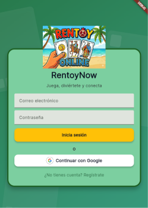 | 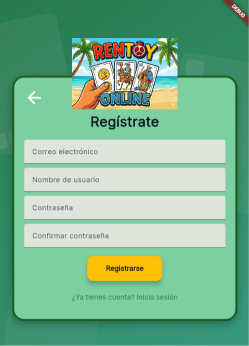 | 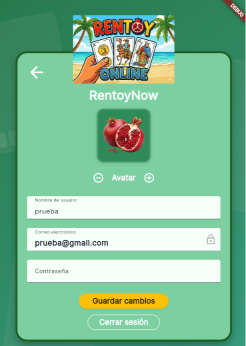 | 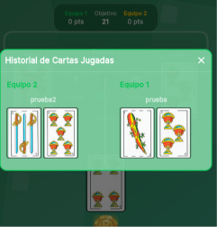 |

### Gestión de Salas
| Menú Principal (Home) | Crear Sala | Unirse a Sala | Sala de Espera |
| :---: | :---: | :---: | :---: |
| 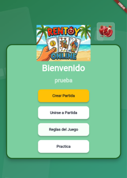 | 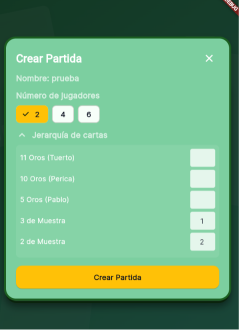 | 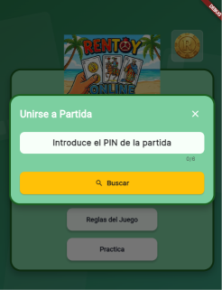 | 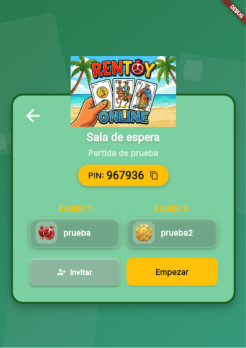 |

### Partida y Reglas
| Partida Activa | Envío / Interacción | Fin de Partida | Reglas |
| :---: | :---: | :---: | :---: |
| 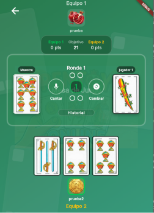 | 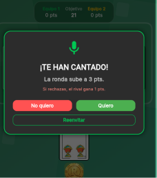 | 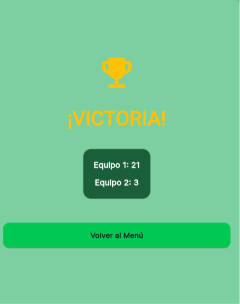 | 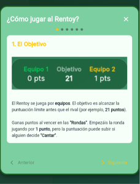 |

## 🛠️ Tecnologías y Dependencias

*   **Framework:** [Flutter](https://flutter.dev/) (SDK ^3.10.0)
*   **Backend & Base de Datos:** Firebase (Core, Auth, Firestore, Realtime Database)
*   **Autenticación:** `google_sign_in`, `firebase_auth`
*   **UI/UX:** `google_fonts`, `cupertino_icons`
*   **Otros:** `share_plus` para compartir información (como el PIN de la sala).

## ⚙️ Instalación y Ejecución

1. Clona o descarga el código fuente de este repositorio.
2. Asegúrate de tener instalado [Flutter](https://docs.flutter.dev/get-started/install).
3. (Importante) Configura tu proyecto en **Firebase** y añade los archivos de configuración necesarios (`google-services.json` para Android, `GoogleService-Info.plist` para iOS o las opciones de configuración para Web).
4. Ejecuta el siguiente comando en la raíz del proyecto para descargar las dependencias:
   ```bash
   flutter pub get
   ```
5. Ejecuta la aplicación en tu dispositivo o emulador:
   ```bash
   flutter run
   ```

## 🧪 Automatización de Pruebas Multijugador

Para información detallada sobre cómo probar el flujo multijugador en local (lanzando múltiples instancias y simulando jugadores simultáneamente en Flutter Web), por favor consulta las guías de automatización y scripts disponibles en el proyecto.
